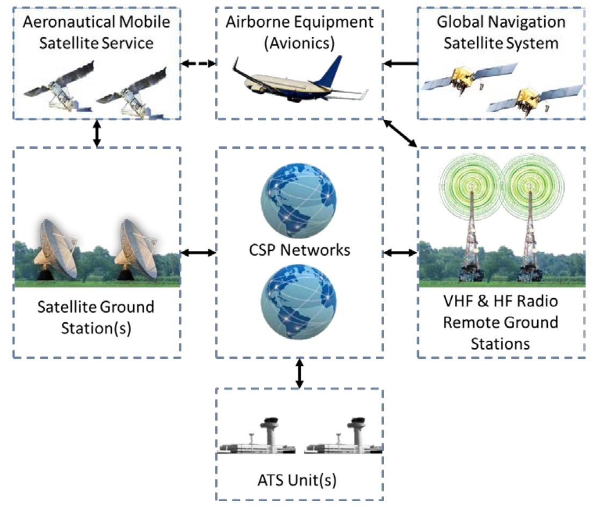

# Data Link Communications

## CHAPTER 2. DATA LINK COMMUNICATION OVERVIEW

### 2.2 What Are Data Link Communications?

"Data link" is a generic term encompassing different types of data link systems and subnetworks. Figure 2-1, Overview Data Link System, provides an overview of a data link system, including subnetworks. While many data link capable aircraft have access to very high frequency (VHF) data link (VDL), not all aircraft have access to additional satellite and/or high frequency (HF) data link capability. Similarly, not all communication service providers (CSP) have HF data link capability.

<AudioPlayer src= '/AC90-117/"Data link" is a generic term.mp3'></AudioPlayer>

#### 2.2.1 Aircraft Communication Addressing and Reporting System (ACARS) and Aeronautical Telecommunications Network (ATN).

There are ACARS-based applications and ATN-based applications. The VDL Digital Link Mode 2 subnetwork supports both ACARS-based and ATN-based applications. The other subnetworks listed in this section support ACARS-based applications only. Controller Pilot Data Link Communication(CPDLC) and Automatic Dependence Surveillance-Contract (ADS-C) can be Future Air Navigation System (FANS) 1/A(+) or ATN-based. The FANS 1/A-based services are used over the ACARS networks and the ATN-based services are used over the ATN networks. The ACARS and ATN networks are not compatible. This AC concentrates on CPDLC and ADS-C using FANS 1/A(+) unless specifically denoted as ATN.

<AudioPlayer src= '/AC90-117/There are ACARS-based applications.mp3'></AudioPlayer>

### 2.4 CPDLC and ADS-C.

#### 2.4.1 CPDLC.

CPDLC is a means of communication between controller and pilot, using data link for air traffic control (ATC) communications. Messages from an aircraft to the Air Traffic Service Unit (ATSU) may follow a standard format or may be free text. Messages from a controller normally follow a standard format and usually require a response from the pilot (see Appendix F, Controller Pilot Data Link Communication (CPDLC) Uplink and Downlink Tables, for uplink message (UM) and downlink message (DM) sets).

<AudioPlayer src= '/AC90-117/CPDLC is a means of communication between controller and pilot.mp3'></AudioPlayer>

## APPENDIX G. TERMINOLOGY AND ACRONYMS

### G.1 Terminology

#### 5. Aircraft Communications Addressing and Reporting System (ACARS)

ACARS is a digital data link system for transmission of short messages between aircraft and ground stations via airband radio or satellite. ACARS as a term refers to the complete air and ground system, consisting of a service provider and aircraft/ground equipment.

<AudioPlayer src= '/AC90-117/ACARS is a digital data link.mp3'></AudioPlayer>

#### 11. Controller-Pilot Data Link Communications (CPDLC).

CPDLC is a two-way data-link communication system by which controllers can transmit digital text messages to an aircraft as an alternative to voice communications. Messages from an aircraft to the ATSU may follow a standard format or may be free text. Messages from a controller normally follow a standard format and usually require a response from the pilot.

<AudioPlayer src= '/AC90-117/CPDLC is a two-way data-link communication.mp3'></AudioPlayer>
