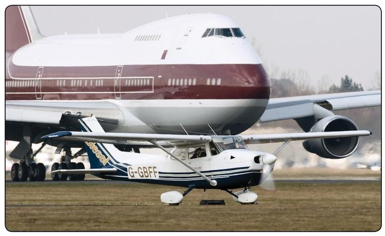

# Airport Operations

## Introduction

Each time a pilot operates an aircraft, the flight normally begins and ends at an airport. An airport may be a small sod field or a large complex utilized by air carriers. This chapter examines airport operations, identifies features of an airport complex, and provides information on operating on or in the vicinity of an airport.

<AudioPlayer src= "/PHAK/chapter-14/Introduction.MP3"></AudioPlayer>

## Airport Categories

The definition for airports refers to any area of land or water used or intended for landing or takeoff of aircraft. This includes, within the five categories of airports listed below, special types of facilities including seaplane bases, heliports, and facilities to accommodate tilt rotor aircraft. An airport includes an area used or intended for airport buildings, facilities, as well as rights of way together with the buildings and facilities.

<AudioPlayer src= "/PHAK/chapter-14/Airport Categories.MP3"></AudioPlayer>

## Preface

The law defines airports by categories of airport activities, including commercial service, primary, cargo service, reliever, and general aviation airports, as shown below:

- Commercial Service Airports—publicly owned airports that have at least 2,500 passenger boardings each calendar year and receive scheduled passenger service. Passenger boardings refer to revenue passenger boardings on an aircraft in service in air commerce whether or not in scheduled service. The definition also includes passengers who continue on an aircraft in international flight that stops at an airport in any of the 50 States for a non-traffic purpose, such as refueling or aircraft maintenance rather than passenger activity.

- Cargo Service Airports—airports that, in addition to any other air transportation services that may be available, are served by aircraft providing air transportation of only cargo with a total annual landed weight of more than 100 million pounds. “Landed weight” means the weight of aircraft transporting only cargo in intrastate, interstate, and foreign air transportation. An airport may be both a commercial service and a cargo service airport.

- Reliever Airports—airports designated by the FAA to relieve congestion at Commercial Service Airports and to provide improved general aviation access to the overall community. These may be publicly or privatelyowned.

- General Aviation Airports — the remaining airports are commonly described as General Aviation Airports. This airport type is the largest single group of airports in the U.S. system. The category also includes privately owned, public use airports that enplane 2500 or more passengers annually and receive scheduled airline service.

<AudioPlayer src= "/PHAK/chapter-14/Preface.MP3"></AudioPlayer>

### Types of Airports

There are two types of airports—towered and nontowered. These types can be further subdivided to:

- Civil Airports—airports that are open to the general public.
- Military/Federal Government airports—airports operated by the military, National Aeronautics and Space Administration (NASA), or other agencies of the Federal Government.
- Private Airports—airports designated for private or restricted use only, not open to the general public.

<AudioPlayer src= "/PHAK/chapter-14/Types of Airports.MP3"></AudioPlayer>

## Wake Turbulence

All aircraft generate wake turbulence during flight. This disturbance is caused by a pair of counter-rotating vortices trailing from the wingtips. The vortices from larger aircraft pose problems to encountering aircraft. The wake of these aircraft can impose rolling moments exceeding the rollcontrol authority of the encountering aircraft. Also, the turbulence generated within the vortices can damage aircraft components and equipment if encountered at close range. For this reason, a pilot must envision the location of the vortex wake and adjust the flight path accordingly.

<AudioPlayer src= "/PHAK/chapter-14/Wake Turbulence.MP3"></AudioPlayer>

### Vortex Generation

Lift is generated by the creation of a pressure differential over the wing surface. The lowest pressure occurs over the upper wing surface and the highest pressure under the wing. This pressure differential triggers the rollup of the airflow aft of the wing resulting in swirling air masses trailing downstream of the wingtips. After the rollup is completed, the wake consists of two counter rotating cylindrical vortices. Most of the energy lies within a few feet of the center of each vortex. [Figure 14-45]

<AudioPlayer src= "/PHAK/chapter-14/Vortex Generation.MP3"></AudioPlayer>

### Vortex Strength

#### Terminal Area

Wake turbulence has historically been thought of as only a function of aircraft weight, but recent research considers additional parameters, such as speed, aspects of the wing, wake decay rates, and aircraft resistance to wake, just to name a few. The vortex characteristics of any aircraft will be changed with the extension of flaps or other wing configuration devices, as well as changing speed. However, as the basic factors are weight and speed, the vortex strength increases proportionately with an increase in aircraft operating weight or decrease in aircraft speed. The greatest vortex strength occurs when the generating aircraft is heavy, slow, and clean, since the turbulence from a “dirty” aircraft configuration hastens wake decay.

<AudioPlayer src= "/PHAK/chapter-14/Vortex Strength-Terminal Area.MP3"></AudioPlayer>

#### En Route

En route wake turbulence events have been influenced by changes to the aircraft fleet mix that have more “Super” (A380) and “Heavy” (B-747, B-777, A340, etc.) aircraft operating in the NAS. There have been wake turbulence events in excess of 30NM and 2000 feet lower than the wake generating aircraft. Air density is also a factor in wake strength. Even though the speeds are higher in cruise at high altitude, the reduced air density may result in wake strength comparable to that in the terminal area. In addition, for a given separation distance, the higher speeds in cruise result in less time for the wake to decay before being encountered by a trailing aircraft.

<AudioPlayer src= "/PHAK/chapter-14/Vortex Strength-Enroute.MP3"></AudioPlayer>

### Vortex Behavior

Trailing vortices have certain behavioral characteristics that can help a pilot visualize the wake location and take avoidance precautions.

Vortices are generated from the moment an aircraft leaves the ground (until it touches down), since trailing vortices are the byproduct of wing lift. [Figure 14-46] The vortex circulation is outward, upward, and around the wingtips when viewed from either ahead or behind the aircraft. Tests with large aircraft have shown that vortices remain spaced a bit less than a wingspan apart, drifting with the wind, at altitudes greater than a wingspan from the ground. Tests have also shown that the vortices sink at a rate of several hundred feet per minute, slowing their descent and diminishing in strength with time and distance behind the generating aircraft.

When the vortices of larger aircraft sink close to the ground (within 100 to 200 feet), they tend to move laterally over the ground at a speed of 2–3 knots. A crosswind decreases the lateral movement of the upwind vortex and increases the movement of the downwind vortex. A light quartering tailwind presents the worst case scenario as the wake vortices could be all present along a significant portion of the final approach and extended centerline and not just in the touchdown zone as typically expected.

<AudioPlayer src= "/PHAK/chapter-14/Vortex Behavior.MP3"></AudioPlayer>

## Collision Avoidance

The following procedures and considerations are in place to assist pilots in collision avoidance under various situations:

- Before takeoff—prior to taxiing onto a runway or landing area in preparation for takeoff, pilots should scan the approach area for possible landing traffic, executing appropriate maneuvers to provide a clear view of the approach areas.
- Climbs and descents—during climbs and descents in flight conditions that permit visual detection of other traffic, pilots should execute gentle banks left and right at a frequency that permits continuous visual scanning of the airspace.
- Straight and level—during sustained periods of straight-and-level flight, a pilot should execute appropriate clearing procedures at periodic intervals.
- Traffic patterns—entries into traffic patterns while descending should be avoided.
- Traffic at VOR sites—due to converging traffic, sustained vigilance should be maintained in the vicinity of VORs and intersections.
- Training operations—vigilance should be maintained and clearing turns should be made prior to a practice maneuver. During instruction, the pilot should be asked to verbalize the clearing procedures (call out “clear left, right, above, and below”).

High-wing and low-wing aircraft have their respective blind spots. The pilot of a high-wing aircraft should momentarily raise the wing in the direction of the intended turn and look for traffic prior to commencing the turn. The pilot of a low- wing aircraft should momentarily lower the wing and look for traffic prior to commencing the turn.

### Training Operations

Operators of pilot training programs are urged to adopt the following practices:

- Pilots undergoing flight instruction at all levels should be requested to verbalize clearing procedures (call out “clear” left, right, above, or below) to instill and sustain the habit of vigilance during maneuvering.

- High-wing airplane. Momentarily raise the wing in the direction of the intended turn and look.

- Low-wing airplane. Momentarily lower the wing in the direction of the intended turn and look.

- Appropriate clearing procedures should precede the execution of all turns including chandelles, lazy eights, stalls, slow flight, climbs, straight and level, spins, and other combination maneuvers.

### Scanning Techniques for Traffic Avoidance

Pilots must be aware of the limitations inherent in the visual scanning process. These limitations may include:

- Reduced scan frequency due to concentration on flight instruments or tablets and distraction with passengers.
- Blind spots related to high-wing and low-wing aircraft in addition to windshield posts and sun visors.
- Prevailing weather conditions including reduced visibility and the position of the sun.
- The attitude of the aircraft will create additional blind spots.
- The physical limitations of the human eye, including the time required to (re)focus on near and far objects, from the instruments to the horizon for example; empty field myopia, narrow field of vision and atmospheric lighting all affect our ability to detect another aircraft.

<AudioPlayer src= "/PHAK/chapter-14/Scanning Techniques for Traffic Avoidance.MP3"></AudioPlayer>

#### Best practices to see and avoid:

- ADS-B In is an effective system to help pilots see and avoid other aircraft. If your aircraft is equipped with ADS-B In, it is important to understand its features and how to use it properly. Many units provide visual and/or audio alerts to supplement the system's traffic display. Pilots should incorporate the traffic display in their normal traffic scan to provide awareness of nearby aircraft. Prior to taxiing onto an airport movement area, ADS-B In can provide advance indication of arriving aircraft and aircraft in the traffic pattern. Systems that incorporate a traffic- alerting feature can help minimize the pilot's inclination to fixate on the display. Refer to 4-57e, ADS-B Limitations.

- Understand the limitations of ADS-B In. In certain airspace, not all aircraft will be equipped with ADS-B Out or transponders and will not be visible on your ADS-B In display.

- Limit the amount of time that you focus on flight instruments or tablets.

- Develop a strategic approach to scanning for traffic. Scan the entire sky and try not to focus straight ahead.

<AudioPlayer src= "/PHAK/chapter-14/Best practices to see and avoid.MP3"></AudioPlayer>

### Pilot Deviations (PDs)

A pilot deviation (PD) is an action of a pilot that violates any Federal Aviation Regulation. While PDs should be avoided, the regulations do authorize deviations from a clearance in response to a traffic alert and collision avoidance system resolution advisory. You must notify ATC as soon as possible following a deviation.

Pilot deviations can occur in several different ways. Airborne deviations result when a pilot strays from an assigned heading or altitude or from an instrument procedure, or if the pilot penetrates controlled or restricted airspace without ATC clearance.

To prevent airborne deviations, follow these steps:

- Plan each flight—you may have flown the flight many times before but conditions and situations can change rapidly, such as in the case of a pop-up temporary flight restriction (TFR). Take a few minutes prior to each flight to plan accordingly.
- Talk and squawk—Proper communication with ATC has its benefits. Flight following often makes the controller’s job easier because they can better integrate VFR and IFR traffic.
- Give yourself some room—GPS is usually more precise than ATC radar. Using your GPS to fly up to and along the line of the airspace you are trying to avoid could result in a pilot deviation because ATC radar may show you within the restricted airspace.

<AudioPlayer src= "/PHAK/chapter-14/Pilot-Deviations-01.MP3"></AudioPlayer>

Ground deviations (also called surface deviations) include taxiing, taking off, or landing without clearance, deviating from an assigned taxi route, or failing to hold short of an assigned clearance limit. To prevent ground deviations, stay alert during ground operations. Pilot deviations can and frequently do occur on the ground. Many strategies and tactics pilots use to avoid airborne deviations also work on the ground.

Pilots should also remain vigilant about vehicle/pedestrian deviations (V/PDs). A vehicle or pedestrian deviation includes pedestrians, vehicles or other objects interfering with aircraft operations by entering or moving on the runway movement area without authorization from air traffic control. In serious instances, any ground deviation (PD or VPD) can result in a runway incursion. Best practices in preventing ground deviations can be found in the following section under runway incursion avoidance.

<AudioPlayer src= "/PHAK/chapter-14/Pilot-Deviations-02.MP3"></AudioPlayer>

### Runway Incursion Avoidance

A runway incursion is “any occurrence in the airport runway environment involving an aircraft, vehicle, person, or object on the ground that creates a collision hazard or results in a loss of required separation with an aircraft taking off, intending to take off, landing, or intending to land.” It is important to give the same attention to operating on the surface as in other phases of flights. Proper planning can prevent runway incursions and the possibility of a ground collision. A pilot should always be aware of the aircraft’s position on the surface at all times and be aware of other aircraft and vehicle operations on the airport. At times, towered airports can be busy and taxi instructions complex. In this situation, it may be advisable to write down taxi instructions. The following are some practices to help prevent a runway incursion:

- Read back all runway crossing and/or hold instructions.
- Review airport layouts as part of preflight planning, before descending to land and while taxiing, as needed.
- Know airport signage.
- Review NOTAM for information on runway/ taxiway closures and construction areas.
- Request progressive taxi instructions from ATC when unsure of the taxi route.
- Check for traffic before crossing any runway hold line and before entering a taxiway.
- Turn on aircraft lights and the rotating beacon or strobe lights while taxing.
- When landing, clear the active runway as soon as possible, then wait for taxi instructions before further movement.
- Study and use proper phraseology in order to understand and respond to ground control instructions.
- Write down complex taxi instructions at unfamiliar airports.

<AudioPlayer src= "/PHAK/chapter-14/Runway-Incursion-01.MP3"></AudioPlayer>

Approximately three runway incursions occur each day at towered airports within the United States. The potential that these numbers present for a catastrophic accident is unacceptable. The following are examples of pilot deviations, operational incidents (OI), and vehicle (driver) deviations that may lead to runway incursions.

Pilot Deviations:

- Crossing a runway hold marking without clearance from ATC
- Taking off without clearance
- Landing without clearance

Operational Incidents (OI):

- Clearing an aircraft onto a runway while another aircraft is landing on the same runway
- Issuing a takeoff clearance while the runway is occupied by another aircraft or vehicle

Vehicle (Driver) Deviations:

- Crossing a runway hold marking without ATC clearance

According to FAA data, approximately 65 percent of all runway incursions are caused by pilots. Of the pilot runway incursions, FAA data shows almost half of those incursions are caused by GA pilots.

<AudioPlayer src= "/PHAK/chapter-14/Runway-Incursion-02.MP3"></AudioPlayer>

### Causal Factors of Runway Incursions

Detailed investigations of runway incursions over the past 10 years have identified three major areas contributing to these events:

- Failure to comply with ATC instructions
- Lack of airport familiarity
- Nonconformance with standard operating procedures

Clear, concise, and effective pilot/controller communication is paramount to safe airport surface operations. You must fully understand and comply with all ATC instructions. It is mandatory to read back all runway “hold short” instructions verbatim.

Taxiing on an unfamiliar airport can be very challenging, especially during hours of darkness or low visibility. A request may be made for progressive taxi instructions which include step by step taxi routing instructions. Ensure you have a current airport diagram, remain “heads-up” with eyes outside, and devote your entire attention to surface navigation per ATC clearance. All checklists should be completed while the aircraft is stopped. There is no place for non-essential chatter or other activities while maintaining vigilance during taxi. [Figure 14-48]

<AudioPlayer src= "/PHAK/chapter-14/Causal Factors of Runway Incursions.MP3"></AudioPlayer>

